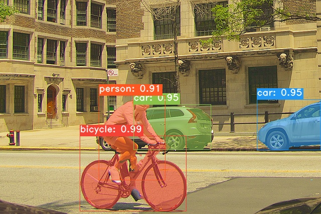
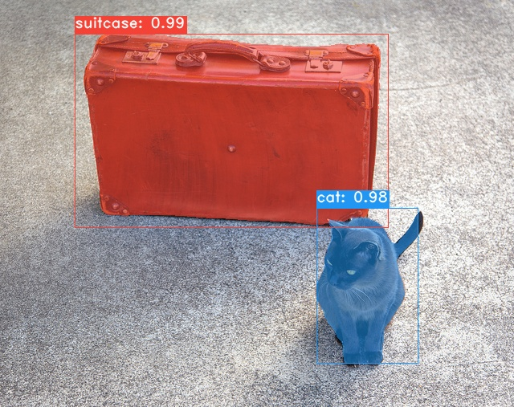

## **This fork has been updated to work with Vitis-AI v2.0 tools**

### High-level list of updates:
- Prior box cacluation has been removed from yolact.py

  **Note:** Prior box calculation has only been tested with the ResNet-50 backbone; prior box calculation for other backbones will most likely be incorrect.

- Removed detection post-processing from yolact.py

  **Note:** eval.py has not been tested with video inputs and probably does not work

- Tweaked some of the model layers to be compatible with the Vitis-AI supported layers (managed to not need to re-train the modified model)


# **Y**ou **O**nly **L**ook **A**t **C**oefficien**T**s
```
    ██╗   ██╗ ██████╗ ██╗      █████╗  ██████╗████████╗
    ╚██╗ ██╔╝██╔═══██╗██║     ██╔══██╗██╔════╝╚══██╔══╝
     ╚████╔╝ ██║   ██║██║     ███████║██║        ██║
      ╚██╔╝  ██║   ██║██║     ██╔══██║██║        ██║
       ██║   ╚██████╔╝███████╗██║  ██║╚██████╗   ██║
       ╚═╝    ╚═════╝ ╚══════╝╚═╝  ╚═╝ ╚═════╝   ╚═╝
```

A simple, fully convolutional model for real-time instance segmentation. This is the code for our papers:
 - [YOLACT: Real-time Instance Segmentation](https://arxiv.org/abs/1904.02689)
 - [YOLACT++: Better Real-time Instance Segmentation](https://arxiv.org/abs/1912.06218)

#### YOLACT++ (v1.2) released! ([Changelog](CHANGELOG.md))
YOLACT++'s resnet50 model runs at 33.5 fps on a Titan Xp and achieves 34.1 mAP on COCO's `test-dev` (check out our journal paper [here](https://arxiv.org/abs/1912.06218)).

In order to use YOLACT++, make sure you compile the DCNv2 code. (See [Installation](https://github.com/dbolya/yolact#installation))

Some examples using the YOLACT base model (Processed using AMD/Xilinx VCK190 dev. board):





# Installation
 - Clone the Vitis-AI repository
   ```bash
   git clone --recurse-submodules https://github.com/Xilinx/Vitis-AI
   cd Vitis-AI
   ```

 - Clone this repository:
   ```bash
   git clone https://github.com/dsp-avt/yolact_vitis_ai.git
   ```

 - Set up the Vitis-AI GPU docker container using the [Vitis-AI Getting Started](https://github.com/xilinx/Vitis-AI#getting-started) guide

   **Note:**  The GPU docker container is needed for YOLACT

 - Launch the Vitis-AI GPU docker container
   ```bash
   ./docker_run.sh xilinx/vitis-ai-gpu:latest
   ```

 - Activate the Vitis-AI PyTorch conda environment
   ```bash
   conda activate vitis-ai-pytorch
   ```

   **NOTE:** From this point forward all commands are intended to be executed inside of the Vitis-AI docker container with the vitis-ai-pytorch conda environment activated.  The exception to this are commands executed on a development kit.

- Change to the ``yolact_vitis_ai`` directory
    ```bash
    cd yolact_vitis_ai
    ```

 - Install YOLACT library prerequisites
    ```bash
    pip install -r requirements.txt
    ```

 - Download the COCO dataset and the 2014/2017 annotations. Note that this script will take a while and dump 21gb of files into `./data/coco`.
   ```bash
   sh data/scripts/COCO.sh
   ```
 - Download `test-dev` dataset with this script.
   ```bash
   sh data/scripts/COCO_test.sh
   ```

# Evaluation
Here is the Resnet50-FPN YOLACT model (released on April 5th, 2019) along with the estimated FPS and mAP on a AMD/Xilinx development kits with the COCO validation data set:

| Image Size | Backbone      | estimated FPS<sup>1</sup>  | estimated mAP<sup>2</sup>  | Weights                                                                                                              |  |
|:----------:|:-------------:|:----:|:----:|----------------------------------------------------------------------------------------------------------------------|--------|
| 550        | Resnet50-FPN  | 86 (VCK190<sup>3</sup>) | 28.7 | [yolact_resnet50_54_800000.pth](https://drive.google.com/file/d/1yp7ZbbDwvMiFJEq4ptVKTYTI2VeRDXl0/view?usp=sharing)  | [Mirror](https://ucdavis365-my.sharepoint.com/:u:/g/personal/yongjaelee_ucdavis_edu/EUVpxoSXaqNIlssoLKOEoCcB1m0RpzGq_Khp5n1VX3zcUw) |
| 550        | Resnet50-FPN  | 14 (ZCU104<sup>4</sup>) | 28.7 | [yolact_resnet50_54_800000.pth](https://drive.google.com/file/d/1yp7ZbbDwvMiFJEq4ptVKTYTI2VeRDXl0/view?usp=sharing)  | [Mirror](https://ucdavis365-my.sharepoint.com/:u:/g/personal/yongjaelee_ucdavis_edu/EUVpxoSXaqNIlssoLKOEoCcB1m0RpzGq_Khp5n1VX3zcUw) |

**Notes:**
  1) the estimated FPS assumes multi-threading, and does not include pre/post-processing times

  2) the estimated mAP is measured using the quantized model evaluated on the host system; mAP of compiled model running on target hardware may be different

  3) Performance measured using the ``xdputil benchmark`` utility on the VCK190 configured with the ``C32B3`` DPU

  4) Performance measured using the ``xdputil benchmark`` utility on the ZCU104 configured with dual ``B4096`` DPUs

To evalute the model, put the corresponding weights file in the `./weights` directory and run one of the following commands. The name of each config is everything before the numbers in the file name (e.g., `yolact_resnet50` for `yolact_resnet50_54_800000.pth`).

## Quantitative Results on COCO
```bash
# Quantitatively evaluate the floating-point trained model on the entire validation set. Make sure you have COCO downloaded as above.
python eval.py --trained_model=weights/yolact_resnet50_54_800000.pth
```
## Quantize model & evaluate on COCO
```bash
# Perform quantize calibration on the floating-point model to convert to int8 weight & activations
python eval.py --trained_model=weights/yolact_resnet50_54_800000.pth --quantize_calibrate --max_images=10

# Perform quantized model evaluation on the entire valdidation set
python eval.py --trained_model=weights/yolact_resnet50_54_800000.pth --quantize_test
```

## Images
```bash
# Process an image on the host development machine using the quantized model and save it to another file.
python eval.py --trained_model=weights/yolact_resnet50_54_800000.pth --score_threshold=0.15 --top_k=15 --image=data/coco/images/000000000552.jpg:output_image.jpg --quantize_test
```

The command above stores the floating-point result in output_image.jpg, and the quantized model result is stored in output_image_quant.jpg.

## Running on AMD/Xilinx Development Kits
 - Compile the quantized model for the target device
   + For the VCK190
     ```bash
     vai_c_xir \
       --xmodel quant_out/Yolact_int.xmodel \
       --arch /opt/vitis_ai/compiler/arch/DPUCVDX8G/VCK190/arch.json \
       --net_name yolact \
       --output_dir compiled_yolact_model
     ```
   + For the ZCU104
     ```
     vai_c_xir \
       --xmodel quant_out/Yolact_int.xmodel \
       --arch /opt/vitis_ai/compiler/arch/DPUCZDX8G/ZCU104/arch.json \
       --net_name yolact \
       --output_dir compiled_yolact_model
     ```
   + For the KV260
     ```
     vai_c_xir \
       --xmodel quant_out/Yolact_int.xmodel \
       --arch /opt/vitis_ai/compiler/arch/DPUCZDX8G/KV260/arch.json \
       --net_name yolact \
       --output_dir compiled_yolact_model
     ```

 - Copy the compiled model to the target application directory
   ```bash
   mkdir -p target_app/yolact/model
   cp compiled_yolact_model/yolact.xmodel target_app/yolact/model/.
   ```

 - Copy test data from the COCO data set to the target application directory
   ```bash
   mkdir -p target_app/yolact/data/images
   cp data/coco/images/000000000552.jpg target_app/yolact/data/images/.
   cp data/coco/images/000000103817.jpg target_app/yolact/data/images/.
   cp data/coco/images/000000403834.jpg target_app/yolact/data/images/.
   cp data/coco/images/000000482002.jpg target_app/yolact/data/images/.
   ```

 - Follow the target setup instructions for your development kit
   + [MPSoC boards](https://github.com/Xilinx/Vitis-AI/blob/master/setup/mpsoc/VART/README.md#step2-setup-the-target)
   + [VCK190](https://github.com/Xilinx/Vitis-AI/blob/master/setup/vck190/README.md#step2-setup-the-target)


 - Copy the ``yolact_vitis_ai/target_app/yolact`` directory to the ``/home/root`` directory of your development board

 - **On the development board** navigate to the target application directory and compile the application
   ```bash
   cd ~/yolact
   ./build.sh
   ```

  - **On the development board** run the test application with a single image
    ```bash
    ./yolact.exe --image data/images/000000000552.jpg --score_thresh 0.5
    ```

    **Note:** If you would like to display the result on a **DisplayPort** monitor connected to the development board then you will need to set the ``DISPLAY`` environment variable to ``:0.0``

  - **On the development board** run the test application with multiple images
    ```bash
    ./yolact.exe \
        --image data/images/000000000552.jpg \
        --image data/images/000000103817.jpg \
        --image data/images/000000403834.jpg \
        --image data/images/000000482002.jpg \
        --score_thresh 0.5
    ```

  **Note:** The target test application only uses a single SW thread, and greater performance could be achieved through multi-threading


# Training
By default, we train on COCO. Make sure to download the entire dataset using the commands above.
 - To train, grab an imagenet-pretrained model and put it in `./weights`.
   - For Resnet50, download `resnet50-19c8e357.pth` from [here](https://drive.google.com/file/d/1Jy3yCdbatgXa5YYIdTCRrSV0S9V5g1rn/view?usp=sharing).
 - Run one of the training commands below.
   - Note that you can press ctrl+c while training and it will save an `*_interrupt.pth` file at the current iteration.
   - All weights are saved in the `./weights` directory by default with the file name `<config>_<epoch>_<iter>.pth`.
```bash
# Trains using the base config with a batch size of 8 (the default).
python train.py --config=yolact_resnet50_config

# Trains yolact_base_config with a batch_size of 5. For the 550px models, 1 batch takes up around 1.5 gigs of VRAM, so specify accordingly.
python train.py --config=yolact_resnet50_config --batch_size=5

# Resume training yolact_base with a specific weight file and start from the iteration specified in the weight file's name.
python train.py --config=yolact_resnet50_config --resume=weights/yolact_resnet50_10_32100.pth --start_iter=-1

# Use the help option to see a description of all available command line arguments
python train.py --help
```

## Multi-GPU Support
YOLACT now supports multiple GPUs seamlessly during training:

 - Before running any of the scripts, run: `export CUDA_VISIBLE_DEVICES=[gpus]`
   - Where you should replace [gpus] with a comma separated list of the index of each GPU you want to use (e.g., 0,1,2,3).
   - You should still do this if only using 1 GPU.
   - You can check the indices of your GPUs with `nvidia-smi`.
 - Then, simply set the batch size to `8*num_gpus` with the training commands above. The training script will automatically scale the hyperparameters to the right values.
   - If you have memory to spare you can increase the batch size further, but keep it a multiple of the number of GPUs you're using.
   - If you want to allocate the images per GPU specific for different GPUs, you can use `--batch_alloc=[alloc]` where [alloc] is a comma seprated list containing the number of images on each GPU. This must sum to `batch_size`.

## Logging
YOLACT now logs training and validation information by default. You can disable this with `--no_log`. A guide on how to visualize these logs is coming soon, but now you can look at `LogVizualizer` in `utils/logger.py` for help.

## Pascal SBD
We also include a config for training on Pascal SBD annotations (for rapid experimentation or comparing with other methods). To train on Pascal SBD, proceed with the following steps:
 1. Download the dataset from [here](http://home.bharathh.info/pubs/codes/SBD/download.html). It's the first link in the top "Overview" section (and the file is called `benchmark.tgz`).
 2. Extract the dataset somewhere. In the dataset there should be a folder called `dataset/img`. Create the directory `./data/sbd` (where `.` is YOLACT's root) and copy `dataset/img` to `./data/sbd/img`.
 4. Download the COCO-style annotations from [here](https://drive.google.com/open?id=1ExrRSPVctHW8Nxrn0SofU1lVhK5Wn0_S).
 5. Extract the annotations into `./data/sbd/`.
 6. Now you can train using `--config=yolact_resnet50_pascal_config`. Check that config to see how to extend it to other models.

I will automate this all with a script soon, don't worry. Also, if you want the script I used to convert the annotations, I put it in `./scripts/convert_sbd.py`, but you'll have to check how it works to be able to use it because I don't actually remember at this point.

If you want to verify our results, you can download our `yolact_resnet50_pascal_config` weights from [here](https://drive.google.com/open?id=1yLVwtkRtNxyl0kxeMCtPXJsXFFyc_FHe). This model should get 72.3 mask AP_50 and 56.2 mask AP_70. Note that the "all" AP isn't the same as the "vol" AP reported in others papers for pascal (they use an averages of the thresholds from `0.1 - 0.9` in increments of `0.1` instead of what COCO uses).

## Custom Datasets
You can also train on your own dataset by following these steps:
 - Create a COCO-style Object Detection JSON annotation file for your dataset. The specification for this can be found [here](http://cocodataset.org/#format-data). Note that we don't use some fields, so the following may be omitted:
   - `info`
   - `liscense`
   - Under `image`: `license, flickr_url, coco_url, date_captured`
   - `categories` (we use our own format for categories, see below)
 - Create a definition for your dataset under `dataset_base` in `data/config.py` (see the comments in `dataset_base` for an explanation of each field):
```Python
my_custom_dataset = dataset_base.copy({
    'name': 'My Dataset',

    'train_images': 'path_to_training_images',
    'train_info':   'path_to_training_annotation',

    'valid_images': 'path_to_validation_images',
    'valid_info':   'path_to_validation_annotation',

    'has_gt': True,
    'class_names': ('my_class_id_1', 'my_class_id_2', 'my_class_id_3', ...)
})
```
 - A couple things to note:
   - Class IDs in the annotation file should start at 1 and increase sequentially on the order of `class_names`. If this isn't the case for your annotation file (like in COCO), see the field `label_map` in `dataset_base`.
   - If you do not want to create a validation split, use the same image path and annotations file for validation. By default (see `python train.py --help`), `train.py` will output validation mAP for the first 5000 images in the dataset every 2 epochs.
 - Finally, in `yolact_base_config` in the same file, change the value for `'dataset'` to `'my_custom_dataset'` or whatever you named the config object above. Then you can use any of the training commands in the previous section.

#### Creating a Custom Dataset from Scratch
See [this nice post by @Amit12690](https://github.com/dbolya/yolact/issues/70#issuecomment-504283008) for tips on how to annotate a custom dataset and prepare it for use with YOLACT.


# Citation
If you use YOLACT or this code base in your work, please cite
```
@inproceedings{yolact-iccv2019,
  author    = {Daniel Bolya and Chong Zhou and Fanyi Xiao and Yong Jae Lee},
  title     = {YOLACT: {Real-time} Instance Segmentation},
  booktitle = {ICCV},
  year      = {2019},
}
```

For YOLACT++, please cite
```
@article{yolact-plus-tpami2020,
  author  = {Daniel Bolya and Chong Zhou and Fanyi Xiao and Yong Jae Lee},
  journal = {IEEE Transactions on Pattern Analysis and Machine Intelligence},
  title   = {YOLACT++: Better Real-time Instance Segmentation},
  year    = {2020},
}
```


# Contact
For questions about our paper or code, please contact [Daniel Bolya](mailto:dbolya@ucdavis.edu).
